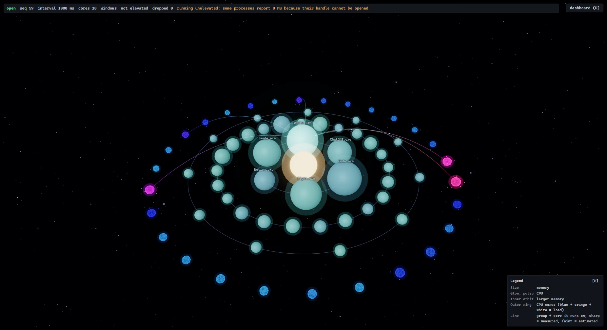

# Pulse Universe

실행 중인 프로세스와 CPU 코어의 상태를 C++ 엔진으로 수집해 브라우저의 3D 우주로 보여주는 Windows 시스템 모니터다.



- 프로세스 **그룹**은 천체다. 크기는 메모리, 맥박과 발광은 CPU 사용률이다.
- CPU 코어는 천체들을 둘러싼 고리 위의 Orb 다. 부하가 오를수록 일그러지고, 뜨거워지고, 불꽃을 튀긴다.
- 그룹에서 코어로 이어지는 빛의 선은 그 그룹이 어느 코어에서 도는지를 나타낸다. 관리자 권한으로 엔진을 띄우면 ETW 로 **실측**한 값이고, 아니면 코어 부하로 **추정**한 값이다. 추정은 흐리게 그려서 실측처럼 보이지 않게 한다.
- 천체를 클릭하면 카메라가 다가가고 자식 프로세스가 위성으로 펼쳐진다.
- 같은 데이터를 숫자 대시보드로도 볼 수 있다. 3D 화면의 숫자가 맞는지 확인하는 용도다.

```
┌─────────────────────┐  WebSocket 1 Hz   ┌────────────────────────────┐
│ engine/  (C++20)    │ ────────────────▶ │ web/  (React + R3F)        │
│ 수집 → 그룹화 → 흐름 │  JSON 스냅샷       │ 보간 → 3D 우주 / 대시보드   │
└─────────────────────┘                   └────────────────────────────┘
```

## 다운로드해서 실행 (빌드 도구 필요 없음)

[Releases](https://github.com/Rafdidas/pulse-universe/releases) 에서 `pulse-engine.exe` 하나만 받아 더블클릭하면 브라우저에 화면이 뜬다 (화면이 exe 안에 들어 있다). 더블클릭 실행용 `.bat` 과 안내 `README.txt` 가 필요하면 `pulse-universe-vX.Y.Z-win-x64.zip` 을 받아 푼다. 관리자 권한이 필요한 실측 흐름은 zip 의 `Start Pulse Universe (Admin).bat` 이다 (UAC 창에서 '아니오'를 누르면 아무것도 뜨지 않는다). exe 옆에 `web/` 폴더(빌드한 `web/dist`)를 두면 내장 화면 대신 그 폴더가 쓰인다. 예전 버전 zip 을 푼 폴더에 새 exe 를 덮어쓸 때는 남아 있는 `web/` 폴더를 지운다. 서명되지 않은 프로그램이라 처음에는 Windows 가 경고할 수 있다 — zip 안의 `README.txt` 에 대처법이 있다. 아래는 소스에서 직접 빌드하는 방법이다.

## 가장 빠른 실행 (소스에서)

빌드 도구(아래 요구 사항)만 갖춰져 있으면 저장소 루트에서 한 줄이다.

```
run.bat                 # 없는 빌드를 만들고, 엔진을 띄우고, 브라우저를 연다
run.bat admin           # 관리자 권한으로: 흐름이 추정이 아니라 실측이 된다 (UAC 창이 뜬다)
run.bat rebuild         # 프런트엔드와 엔진을 다시 빌드한 뒤 실행한다
```

끝내려면 그 창에서 Ctrl+C 를 누른다. 처음에는 빌드 때문에 몇 분 걸린다. 아래 절들은 이것을 손으로 하는 방법과 옵션이다.

## 요구 사항

| | |
|---|---|
| OS | Windows 10 이상 (엔진이 Win32 API 를 쓴다) |
| 엔진 빌드 | Visual Studio 2022 Build Tools (MSVC), CMake 3.25 이상, [vcpkg](https://github.com/microsoft/vcpkg) (`VCPKG_ROOT` 환경 변수) |
| 프런트엔드 | Node.js 24, npm 11 (개발 환경 기준) |
| 브라우저 | WebGL2 를 지원하는 최신 브라우저 |

## 빌드

엔진 (`engine/`, vcpkg 가 Boost 와 Catch2 를 받아 온다):

```bash
cd engine
cmake --build --preset default          # Debug. 첫 빌드는 구성과 의존성 설치로 오래 걸린다
```

프런트엔드 (`web/`):

```bash
cd web
npm install
```

## 실행

개발 모드: 엔진과 dev 서버를 따로 띄운다.

```bash
# 터미널 1 — 엔진 (기본 포트 9000, 브라우저 Origin 은 localhost:5173 만 허용)
engine/build/Debug/pulse-engine.exe --serve

# 터미널 2 — 프런트엔드
cd web && npm run dev                   # http://localhost:5173
```

프로덕션 모드: 엔진이 빌드된 프런트엔드를 직접 서빙한다.

```bash
cd web && npm run build
cd ../engine
build/Debug/pulse-engine.exe --serve --web-root ..\web\dist
# 콘솔에 출력되는 http://127.0.0.1:9000/ 를 연다
```

### 엔진 옵션

```
pulse-engine --dump  [--interval-ms N] [--iterations N] [--max-groups N]
pulse-engine --json  [--interval-ms N] [--max-groups N]
pulse-engine --serve [--port N] [--web-root DIR] [--iterations N]
                     [--interval-ms N] [--max-groups N] [--allow-origin URL]
모든 모드: [--mapping auto|estimated|measured]
```

| 모드 | 하는 일 |
|---|---|
| `--dump` | 프로세스 그룹 표를 주기마다 콘솔에 출력한다. 작업 관리자와 숫자를 대조할 때 쓴다 |
| `--json` | 계약 형식의 스냅샷 하나를 stdout 에 출력하고 끝난다 |
| `--serve` | `127.0.0.1` 에서 WebSocket 으로 스냅샷을 스트리밍한다 |

서버는 `127.0.0.1` 에만 바인딩한다. 브라우저가 보내는 `Origin` 은 허용 목록(`http://localhost:5173`, `http://127.0.0.1:5173`)에 있어야 하고, 다른 출처가 필요하면 `--allow-origin` 을 반복해서 준다.

### 관리자 권한과 스레드-코어 매핑

관리자 권한이 없어도 동작하지만 두 가지가 달라진다.

- 일부 프로세스의 메모리가 0 으로 나온다 (핸들을 열지 못한다). 화면 상단에 안내가 뜬다.
- 그룹에서 코어로 가는 선이 추정이다.

`--mapping` 은 스레드-코어 매핑의 출처를 정한다.

| 값 | 동작 |
|---|---|
| `auto` (기본) | 관리자 권한이면 ETW 문맥 전환 이벤트로 실측하고, 아니면 추정으로 물러난다. 이유는 stderr 에 한 줄 남는다 |
| `estimated` | 측정하지 않는다 |
| `measured` | 실측할 수 없으면 종료 코드 1 로 끝난다 |

실측은 전용 커널 로거 세션(`PulseUniverse-Sched`)을 연다. Release 빌드에서 엔진 전체가 코어 하나의 약 2%, 작업 집합 약 30 MB 를 쓴다 (추정만 할 때는 약 1.5%, 12 MB). Debug 빌드는 훨씬 무겁다 — 상시 사용은 Release 로 빌드한다 (`cmake --build build --config Release`). 정상 종료와 Ctrl+C 에서는 세션이 닫힌다. 엔진이 강제 종료되어 세션이 남았다면 다음 실행이 정리한다. 엔진을 둘 띄우면 나중 것은 추정으로 동작한다.

관리자 권한으로 띄우려면 "관리자 권한으로 실행" 한 터미널에서 같은 명령을 쓰면 된다. 화면 상단 배지에 `elevated` 가 뜨면 실측 중이다.

## 화면 조작

| 조작 | 동작 |
|---|---|
| 마우스 이동 | 천체·코어에 올리면 이름과 값을 보여주고, 이어진 선만 밝힌다. 가운데 별에 올리면 시스템 CPU·메모리 요약이 뜬다. 가장 안쪽 궤도의 큰 천체는 이름이 항상 보인다 |
| 천체 클릭 | 그 그룹에 초점: 카메라가 다가가고, 자식 프로세스가 위성으로 펼쳐지고, 배경이 흐려진다 |
| `Esc` / 빈 곳·별 클릭 | 초점을 푼다 |
| 드래그 / 휠 | 궤도 카메라 조작 (한 번 조작하면 자동 회전을 멈춘다) |
| `D` | 우주와 대시보드 전환 (`#dashboard`) |
| `P` | 성능 표시: 프레임 시간, fps, dpr, draw call, 삼각형 |
| `H` | 범례(오른쪽 아래) 접기·펴기. 초점 중에는 숨는다 |

GPU 가 느리면 해상도(dpr)를 자동으로 낮춘다.

## 릴리스 만들기

`scripts/package.ps1 -Version 0.1.0` 이 프런트엔드를 빌드하고 `scripts/make-pak.ps1` 로 `web.pak` 으로 묶은 뒤, 엔진을 정적 링크(외부 DLL·Visual C++ 재배포 패키지 필요 없음)로 빌드하며 그 pak 을 exe 에 내장한다. `dist-release/` 에 `pulse-engine.exe`, zip, 각각의 `.sha256` 이 나오고, 스크립트 끝에서 exe 만으로 화면이 서빙되는지 확인한다. `v0.1.0` 같은 태그를 푸시하면 GitHub Actions 가 같은 스크립트로 이 네 파일을 릴리스에 올린다. 푸시와 PR 마다 `CI` 워크플로가 웹·엔진 테스트를 돌린다. 내장 없이 개발할 때는 지금처럼 `--serve --web-root web/dist` 를 쓴다.

## 코드 서명 정책

서명은 [SignPath Foundation](https://signpath.org/) 의 승인을 받은 릴리스부터 적용된다 (설정 절차: [docs/signing-setup.md](docs/signing-setup.md)).

Free code signing provided by [SignPath.io](https://signpath.io), certificate by [SignPath Foundation](https://signpath.org/).

- 팀 역할 — Committers and reviewers: [Rafdidas](https://github.com/Rafdidas). Approvers: [Rafdidas](https://github.com/Rafdidas).
- 개인정보 — This program will not transfer any information to other networked systems unless specifically requested by the user or the person installing or operating it. 엔진은 127.0.0.1 에서만 듣고 외부로 아무것도 보내지 않는다.
- 제거 — 설치하지 않는다. 받은 exe 나 푼 폴더를 지우면 된다.
- 서명 대상 — GitHub Actions 가 이 저장소의 소스로 빌드한 `pulse-engine.exe` 뿐이다.

## 테스트

```bash
# 엔진
cd engine && ./build/tests/Debug/pulse-tests.exe

# 프런트엔드
cd web && npm test && npm run typecheck && npm run lint
```

- 엔진 테스트 중 ETW 수집기 세 개는 관리자 권한에서만 돈다. 권한이 없으면 `SKIP` 으로 끝나는 것이 정상이다.
- 3D 장면은 자동 테스트하지 않는다. 엔진에 붙여 브라우저에서 확인한다.
- 프런트엔드 안의 구조와 규칙은 [web/README.md](web/README.md) 에 있다.

## 구조

```
engine/src/
  platform/   OS 접근의 유일한 경계. Win32 (Toolhelp, PSAPI, PDH, ETW) 는 여기에만 있다
  core/       순수 로직: CPU 델타, 그룹화, 필터, 생명주기, 흐름 추정·실측, 스냅샷 조립
  network/    직렬화, WebSocket, 정적 파일
  app/        샘플링 루프, 서버
  cli/        옵션, 표 출력
web/src/
  protocol/   zod 스키마 (계약)
  stream/ state/   연결, 보간, 상태
  visual/     순수 TS: 매핑, 배치, 존재 추적, 흐름, 후처리 상수
  scene/      R3F 장면
  dashboard/  숫자 대시보드
```

레이어는 인접 레이어의 구현을 모른다. 프런트엔드는 Win32 구조체가 아니라 계약(JSON 스키마)만 읽으므로, 수집 방식을 바꿔도(추정 → ETW 실측) 시각화 코드는 바뀌지 않았다.

## 문서

설계는 `docs/superpowers/` 에 있다. 계약서가 기준이고, 단계마다 스펙과 구현 계획이 있다.

| 단계 | 내용 | 스펙 |
|---|---|---|
| 계약 | 4개 레이어 사이의 인터페이스와 데이터 계약 | [contract-design](docs/superpowers/specs/2026-09-22-pulse-universe-contract-design.md) |
| M1 | 엔진 수집, `--dump` | plans/[m1](docs/superpowers/plans/2026-09-22-m1-engine-collection.md) |
| M2 | WebSocket 전송 | [m2](docs/superpowers/specs/2026-09-23-m2-transport-design.md) |
| M3 | 데이터 레이어와 숫자 대시보드 | [m3](docs/superpowers/specs/2026-09-23-m3-frontend-design.md) |
| M4 | R3F 장면, 프로세스 노드 | [m4](docs/superpowers/specs/2026-09-28-m4-universe-scene-design.md) |
| M5 | 생성·종료, Focus, 카메라 | [m5](docs/superpowers/specs/2026-09-28-m5-lifecycle-focus-design.md) |
| M6 | CPU 코어 Orb, 셰이더, 불꽃 | [m6](docs/superpowers/specs/2026-09-29-m6-core-orbs-design.md) |
| M7 | 스레드 흐름 | [m7](docs/superpowers/specs/2026-09-29-m7-thread-flow-design.md) |
| M8 | Bloom, 초점 심도, 최종 룩 | [m8](docs/superpowers/specs/2026-09-29-m8-final-look-design.md) |
| M9 | 최적화, 성능 표시 | [m9](docs/superpowers/specs/2026-09-29-m9-optimization-design.md) |
| 확장 | ETW 실측 스레드-코어 매핑 | [etw](docs/superpowers/specs/2026-09-30-etw-thread-mapping-design.md) |

각 스펙은 그 단계의 측정 결과와 결정(D 번호)을 담고 있다. 구현 계획은 `docs/superpowers/plans/` 에 있다.

## 알려진 한계

- 그룹 메모리는 `WorkingSetSize` 의 합이라 공유 페이지를 중복 계산한다. 작업 관리자의 값과 다르다 (계약서 6.1.1).
- 64 개를 넘는 논리 프로세서 기계에서는 코어 부하(PDH)가 프로세서 그룹 0 만 본다. 실측 흐름은 그 범위 밖 코어를 버린다.
- 반정밀 렌더 타깃이 없는 GPU 에서는 8비트 버퍼로 그린다. 이 경로는 실제 하드웨어에서 확인하지 못했다.
- 콘솔의 `THREE.Clock: This module has been deprecated` 경고는 R3F 내부에서 나오는 것이다.

## 라이선스

MIT — [LICENSE](LICENSE).
